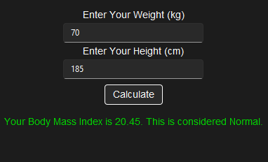

# BMI Hesaplayıcı

BMI (Vücut Kitle İndeksi) Hesaplayıcı, kullanıcının kilo ve boy bilgilerini kullanarak vücut kitle indeksini hesaplayan basit bir Python uygulamasıdır. 

## Gereksinimler

- Python 3.x
- tkinter kütüphanesi (genellikle Python'ın bir parçasıdır)
- sv_ttk kütüphanesi